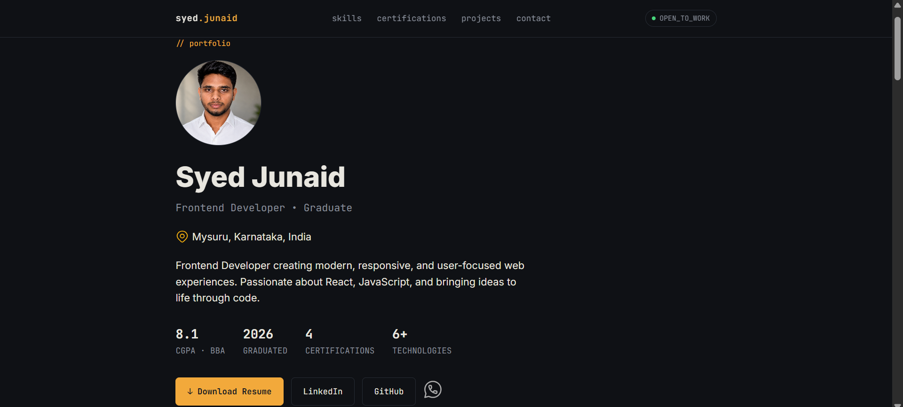
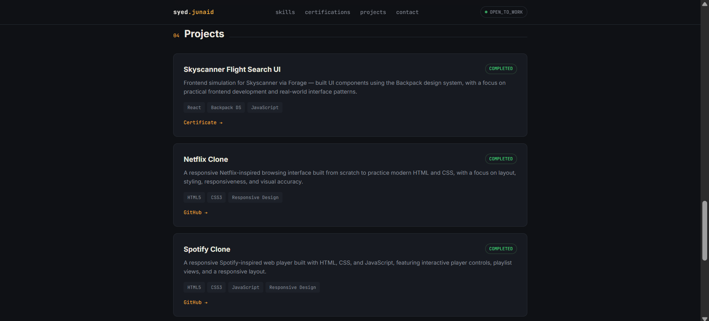

# Syed Junaid — Portfolio

Personal portfolio website showcasing my work, technical skills, projects, certifications, and professional background as a Frontend Developer.

## Live

[View Portfolio](https://portfolio-syed-junaid.vercel.app/)

## Screenshots

### Home

### Projects

## About

BBA graduate focused on Frontend Development, with a strong foundation in HTML and CSS and growing expertise in JavaScript and React.

This portfolio presents selected projects, technical skills, certifications, and professional information.

## Technologies

* HTML5
* CSS3
* JavaScript
* React
* Git
* GitHub
* Vercel

## Projects

### Netflix Clone

Responsive Netflix-inspired browsing interface built with HTML and CSS.

### Spotify Clone

Responsive Spotify-inspired web player built with HTML, CSS, and JavaScript.

### Skyscanner Flight Search UI

Flight search interface developed as part of a React project.

### React Project

Full-scale frontend project currently in development.

## Features

* Responsive design
* Modern user interface
* Project showcase
* Technical skills section
* Certifications
* Professional information
* Contact section
* Responsive navigation

## Tools

* Visual Studio Code
* Git
* GitHub
* Figma
* Vercel

## Contact

LinkedIn: https://www.linkedin.com/in/syed-junaid-b20295358

GitHub: https://github.com/Sjunaid23

Portfolio: https://portfolio-syed-junaid.vercel.app/

---

© 2026 Syed Junaid
